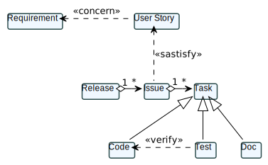

= R5.A.08 -- Dépôt pour les TPs
:icons: font
:MoSCoW: https://fr.wikipedia.org/wiki/M%C3%A9thode_MoSCoW[MoSCoW]

Ce dépôt concerne les rendus de mailto:A_changer@etu.univ-tlse2.fr[Jonh Doe].

== TP1

.Exemple de code
[source,java]
---
@Given("today is Sunday")
public void today_is_sunday() {
    // Write code here that turns the phrase above into concrete actions
    throw new io.cucumber.java.PendingException();
}
---

.Exemple d'image insérée en asciidoc

Contenu du fichier is_it_friday_yet.feature :

[source,gherkin]
----
Feature: Is it Friday yet?
  Everybody wants to know when it's Friday
  Scenario Outline: Check if it's Friday
    Given today is <day>
    When I ask whether it's Friday yet
    Then I should be told "<answer>"

    Examples:
      | day            | answer |
      | Sunday         | Nope   |
      | Friday         | TGIF   |
      | anything else! | Nope   |
----

Capture d'écran de l'exécution des tests avec succès : 

image::https://github.com/IUT-Blagnac/r5-a-08-qualdev-nicolaspoda/blob/main/tests_qui_passent_2.png[]

== TP2...

Cotenu du fichier Order.java

[source,java]
----
public class Order {
    private String owner;
    private String target;
    private List<String> cocktails;

    public Order() {
        this.cocktails = new ArrayList<>();
    }

    public void declareOwner(String owner) {
        this.owner = owner;
    }

    public void declareTarget(String target) {
        this.target = target;
    }

    public void addCocktail(String cocktail) {
        this.cocktails.add(cocktail);
    }

    public List<String> getCocktails() {
        return cocktails;
    }
}
----

Capture d'écran de l'exécutution des tests avec succès :

